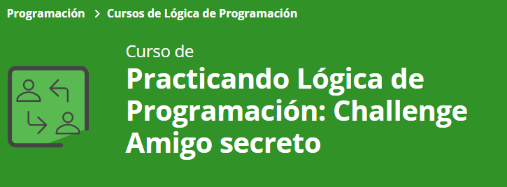

# Practicando Lógica de Programación: Challenge Amigo Secreto

  
  
  

---

## 🔍 Índice
1. [Descripción del Proyecto](#1-Descripción-del-proyecto)
2. [Estado del Proyecto](#2-Estado-del-proyecto)
3. [Demostración de Funciones y Aplicaciones](#3-Demostración-de-funciones-y-aplicaciones)
4. [Acceso al Proyecto](#4-Acceso-al-proyecto)
5. [Tecnologías Utilizadas](#5-Tecnologías-utilizadas)
6. [Personas Desarrolladoras del Proyecto](#6-Personas-desarrolladoras-del-proyecto)
7. [Licencia](#7-Licencia)
8. [Prácticas Recomendadas](#8-Prácticas-recomendadas)
9. [Recursos Adicionales](#9-Recursos-Adicionales)

---

## 1-Descripción del Proyecto
El proyecto **"Amigo Secreto"** es una aplicación web interactiva que permite a los usuarios agregar nombres de amigos a una lista y realizar un sorteo aleatorio para determinar quién será el "amigo secreto". 

Este proyecto se centra en la práctica de conceptos fundamentales de lógica de programación, incluyendo **variables, condicionales, funciones, arrays y bucles**.

---

## 2-Estado del Proyecto

El proyecto se encuentra en estado **finalizado** y ha sido subido a GitHub como parte de la aprobación del curso de **ORACLE ALURA-LATAM**.

---

## 3-Demostración de Funciones y Aplicaciones

### Principales funcionalidades:

- 📝 **Agregar nombres**: Los usuarios pueden escribir el nombre de un amigo en un campo de texto y añadirlo a una lista visible.
- 💡 **Validar entrada**: Si el campo de texto está vacío, el programa muestra una alerta solicitando un nombre válido.
- 👁 **Visualizar la lista**: Los nombres ingresados aparecen en una lista debajo del campo de entrada.
- 🎯 **Sorteo aleatorio**: Se selecciona aleatoriamente un nombre de la lista y se muestra en la página.

[!TIP]  
Para ver la aplicación en acción, accede al enlace del repositorio.

---

## 4-Acceso al Proyecto

Puedes acceder al repositorio del proyecto en el siguiente enlace:

🔗 [Repositorio en GitHub](#)

---

## 5-Tecnologías Utilizadas

- 
- 
- 

----

## 6-Personas Desarrolladoras del Proyecto

Este proyecto fue desarrollado por **[Venecia]**, con la guía y conocimientos adquiridos en los cursos de **Oracle Alura-LATAM**.

---

## 7-Licencia
Este proyecto se encuentra bajo la Licencia MIT. Para más detalles, consulta el archivo LICENSE en el repositorio.

---

## 8-Prácticas recomendadas:

[!IMPORTANT]  
Aplicar buenas prácticas mejora la calidad y mantenibilidad del código.

### CSS 
- **Uso de comentarios estructurados y coherente**: Usa un estilo uniforme para los comentarios en todo tu CSS para mejorar la legibilidad. 
ejemplo: `/* === Sección Name === */`.

-**Agrupación lógica**: Organice su CSS agrupando estilos relacionados, como estilos globales, estilos específicos de componentes y clases de utilidad.

**Comentarios descriptivos**: Proporcione comentarios que expliquen el propósito de las secciones o estilos específicos, lo que puede ser invaluable para el mantenimiento futuro o para otros desarrolladores que colaboren en el proyecto.

### JavaScript (app.js)
- **Crear un array para almacenar los nombres de los amigos**:
-Se declara una variable amigos como un array vacío que almacenará los nombres ingresados por el usuario.
 **Función para agregar amigos (agregarAmigo)**: 
1.Capturar el valor del campo de entrada → Se obtiene el elemento del DOM y se extrae su valor con .trim().
2.Validar la entrada → Si el campo está vacío, se muestra una alerta y se detiene la ejecución con return.
3.Actualizar el array → Se agrega el nombre al array amigos usando .push().
4.Limpiar el campo de entrada → Se vacía el input después de agregar el nombre.
5.Actualizar la lista en el HTML → Se llama a actualizarLista() para reflejar los cambios.
 
- **Validación de entradas (sorteo de amigos)→ (sortearAmigo)**
1.Validar que haya amigos → Si el array está vacío, se muestra una alerta y se detiene la función.
2.Generar un índice aleatorio → Se usa Math.floor(Math.random() * amigos.length).
3.Obtener y mostrar el resultado → Se accede al nombre correspondiente y se actualiza el DOM.

**Asignar eventos a los botones**:
Se agregan eventListener a los botones "Adicionar" y "Sortear Amigo" para que ejecuten agregarAmigo y sortearAmigo, respectivamente.

[!NOTE]  
Este enfoque modulariza el código en funciones claras y específicas, facilitando su mantenimiento y comprensión.

[!NOTE]  
La validación de entradas y la actualización dinámica de la interfaz mejoran la experiencia del usuario y aseguran la integridad de los datos.

[!WARNING]  
Asegúrate de que los IDs en `querySelector` correspondan exactamente a los definidos en tu HTML.

---

## 9-Recursos Adicionales

- [Buenas prácticas en HTML](https://www.w3schools.com/html/html_best_practices.asp)
- [Buenas prácticas en CSS](https://developer.mozilla.org/es/docs/Learn/CSS/Building_blocks/Organizing)
-[Guía de JavaScript](https://developer.mozilla.org/es/docs/Web/JavaScript/Guide)
-[Cómo escribir un README increíble en tu Github](https://www.aluracursos.com/blog/como-escribir-un-readme-increible-en-tu-github)
-[Más sobre array puedes revisar la siguiente documentación](https://developer.mozilla.org/es/docs/Web/JavaScript/Reference/Global_Objects/Array)
-[Crear repositorio en GitHub](https://git-scm.com/doc)
-[Lista de insignias, en Markdown](https://naereen.github.io/badges/)
-[Una lista de distintivos, con su código Markdown, que se pueden incluir en un archivo para un proyecto de GitHub o Bitbucket](https://github.com/Naereen/badges/blob/master/README.md)
-[ Imágenes Y Badges | Curso de Markdown desde cero](https://www.youtube.com/watch?v=1tD9u2-Mg9I)

---
✨ **¡Gracias por visitar este proyecto!** ✨
